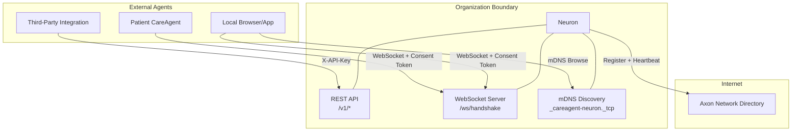
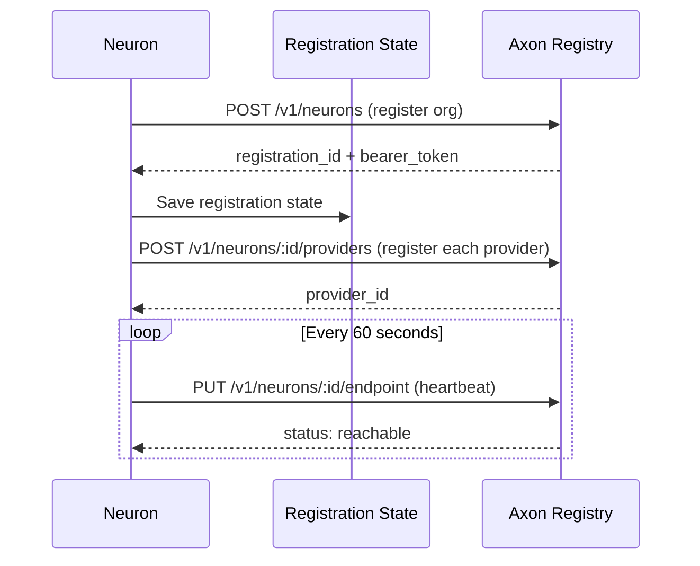
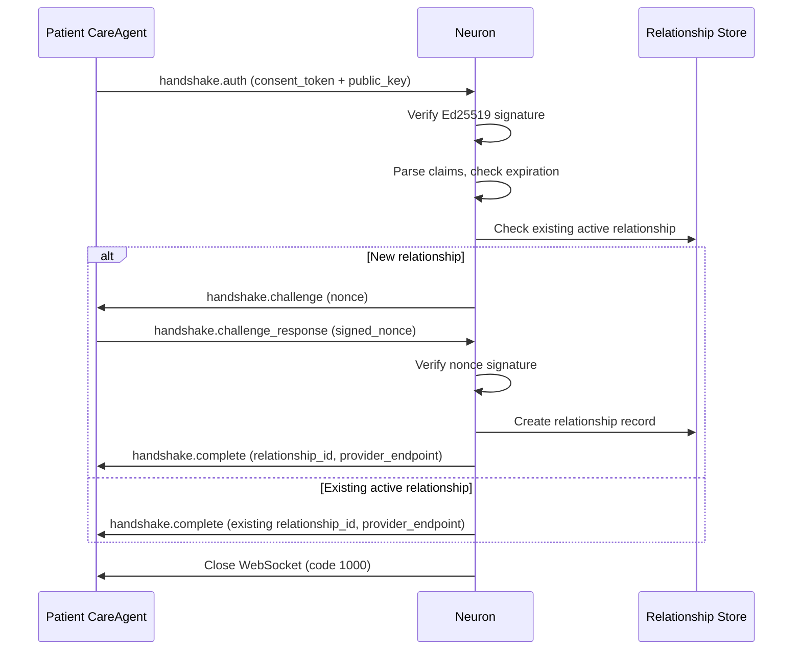
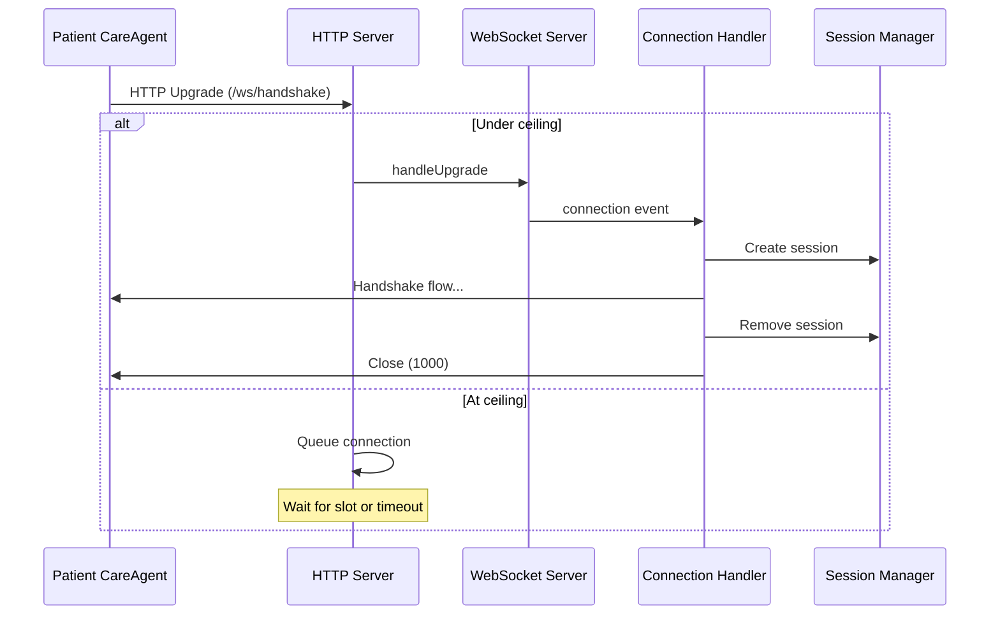
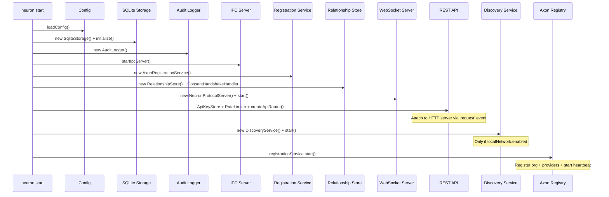
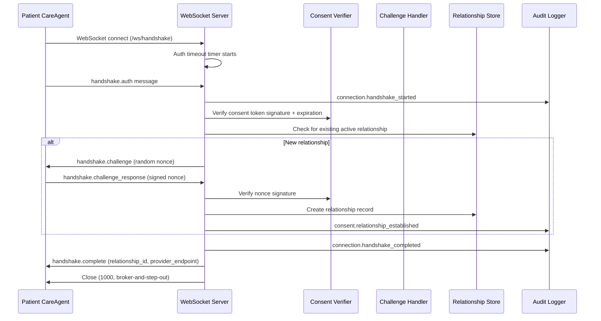
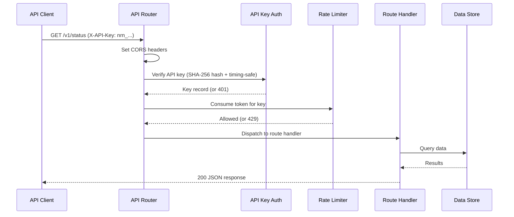

# Neuron Architecture Guide

> **Source of truth:** `src/cli/commands/start.ts` (startup lifecycle), `src/types/config.ts` (configuration schema), individual module directories under `src/`.

## Overview

The Neuron is an organizational boundary node in the CareAgent network. It routes patient CareAgent connections to provider endpoints, verifies consent on every connection, and never holds or processes clinical data.

**Core principle:** Route connections, verify consent, never hold clinical data.



## Subsystem Architecture

### Registration (Axon Integration)

The registration subsystem manages the Neuron's identity within the Axon network directory.

**Key files:** `src/registration/service.ts`, `src/registration/axon-client.ts`, `src/registration/state.ts`, `src/registration/heartbeat.ts`

**Components:**
- `AxonRegistrationService` orchestrates `AxonClient`, `RegistrationStateStore`, and `HeartbeatManager`
- `RegistrationStateStore` persists registration state to SQLite (single-row via `CHECK(id=1)`)
- `HeartbeatManager` sends periodic endpoint updates with exponential backoff (full jitter, AWS pattern)



### Consent Verification

Every patient connection requires a valid Ed25519 consent token. Verification is stateless -- the Neuron re-verifies on every connection attempt (CSNT-02), never caching trust.

**Key files:** `src/relationships/handshake.ts`, `src/consent/verify.ts`, `src/relationships/store.ts`

**Token format:**
- Payload: JSON with `patient_agent_id`, `provider_npi`, `consented_actions`, `iat`, `exp`
- Signature: Ed25519 over the raw payload bytes
- Public key: base64url-encoded raw 32-byte Ed25519 public key, imported via JWK format

**Verification order:**
1. Signature verification (Ed25519, rejects invalid before parsing)
2. JSON parse of payload
3. Expiration check (`exp` field)



### WebSocket Routing

The Neuron implements a "broker-and-step-out" model: verify consent, exchange addresses, disconnect. It does not relay messages between patient and provider.

**Key files:** `src/routing/server.ts`, `src/routing/handler.ts`, `src/routing/session.ts`, `src/routing/types.ts`

**Components:**
- `NeuronProtocolServer`: HTTP server + WebSocket server in `noServer` mode (ws library)
- `createConnectionHandler`: factory producing per-connection handler with handshake state machine
- `HandshakeSessionManager`: tracks active handshake sessions with configurable ceiling

**Safety ceiling:** When `maxConcurrentHandshakes` is reached, new connections are queued (never rejected). Queued connections are promoted when slots open or destroyed after `queueTimeoutMs`.



### Local Discovery

mDNS/DNS-SD advertisement enables local network CareAgent discovery without Axon. Uses `bonjour-service` to advertise a `_careagent-neuron._tcp` service.

**Key files:** `src/discovery/service.ts`, `src/discovery/types.ts`

**TXT records (RFC 6763 Section 6.4, keys <=9 chars):**

| Key | Value | Description |
|-----|-------|-------------|
| `npi` | `1234567893` | Organization NPI |
| `ver` | `v1.0` | Protocol version |
| `ep` | `ws://192.168.1.100:3000/ws/handshake` | WebSocket endpoint URL |

**Service instance name:** `neuron-{NPI}` (unique per organization on LAN)

Local connections use the same WebSocket endpoint and consent verification flow as remote connections (DISC-04).

### REST API

HTTP request handling shares the same `node:http` server as WebSocket. The HTTP server dispatches `request` events to the API router and `upgrade` events to the WebSocket server.

**Key files:** `src/api/router.ts`, `src/api/keys.ts`, `src/api/rate-limiter.ts`, `src/api/openapi-spec.ts`

**Request pipeline:**
1. Parse URL
2. Ignore non-API paths (WebSocket and other handlers pass through)
3. CORS headers (before auth, so preflight always works)
4. Public endpoint check (`/openapi.json` -- no auth)
5. API key authentication (`X-API-Key` header, SHA-256 hash, timing-safe comparison)
6. Rate limiting (per-key token bucket)
7. Route dispatch (regex matching, no framework)

## Startup Lifecycle

Initialization follows a strict dependency order matching `src/cli/commands/start.ts`:



**Shutdown order (reverse):**
1. Stop Discovery (goodbye packets)
2. Stop WebSocket server (close all connections with code 1001)
3. Stop Registration service (stop heartbeat)
4. Close IPC server + remove socket file
5. Close Storage

## Data Flow

### Patient Connection Flow



### REST API Request Flow



## Security

### Trust Model

The Neuron trusts consent tokens signed by patient CareAgents. Trust is verified cryptographically on every connection attempt -- never cached or assumed from prior interactions.

- **No cached trust:** Each connection requires a fresh, valid consent token (stateless re-verification per CSNT-02)
- **Consent scope:** Tokens specify `consented_actions` that limit what the relationship covers
- **Expiration:** Tokens have `iat` (issued at) and `exp` (expiration) claims, enforced on verification

### Consent Verification

- **Algorithm:** Ed25519 (deterministic, no nonce reuse risk)
- **Key format:** Raw 32-byte public keys encoded as base64url, imported via JWK format (`kty: OKP`, `crv: Ed25519`)
- **Verification order:** Signature first (rejects invalid before parsing), then JSON parse, then expiration check
- **Challenge-response:** After consent verification, a random nonce prevents replay attacks. Patient must sign the nonce with the same private key that signed the consent token.

### API Key Authentication

- **Key format:** `nrn_` prefix + 32 random bytes base64url-encoded
- **Storage:** Only SHA-256 hash stored in SQLite -- raw key shown once at creation
- **Comparison:** `crypto.timingSafeEqual` on `Buffer.from(hash, 'hex')` prevents timing attacks
- **Revocation:** Setting `revoked_at` timestamp immediately invalidates the key

### Audit Chain Integrity

- **Format:** Append-only JSONL file with hash-chained entries
- **Hash algorithm:** SHA-256 over canonical JSON representation (deterministic serialization)
- **Chain structure:** Each entry includes `prev_hash` linking to the previous entry
- **Genesis entry:** First entry uses `prev_hash` of 64 zeros (`0000...0000`)
- **Verification:** `verifyAuditChain()` validates the entire chain, detecting tampering or truncation

### Network Security

- **WebSocket protocol:** Text-only JSON envelopes (binary frames rejected)
- **Challenge-response nonces:** 32 random bytes (hex-encoded), 30-second TTL, hard cap of 1000 pending challenges
- **No data relay:** The Neuron exchanges addresses and disconnects. Clinical data flows directly between patient and provider CareAgents.

## IPC Protocol

The Neuron exposes a Unix domain socket for local CLI commands.

**Socket path:** Co-located with database file via `getSocketPath(storagePath)` (e.g., `./data/neuron.sock`)

**Protocol:** NDJSON (one JSON object per newline)

### Command Types

| Command | Fields | Description |
|---------|--------|-------------|
| `provider.add` | `npi` | Register a provider with Axon |
| `provider.remove` | `npi` | Remove a provider from Axon |
| `provider.list` | — | List all registered providers |
| `status` | — | Get neuron registration and heartbeat status |
| `relationship.terminate` | `relationship_id`, `provider_npi`, `reason` | Terminate a care relationship |

### Response Format

```json
{
  "ok": true,
  "data": { ... }
}
```

```json
{
  "ok": false,
  "error": "Error message"
}
```

**Client timeout:** 5 seconds with descriptive error messages. Stale socket cleanup via `unlinkSync` before `server.listen`.
